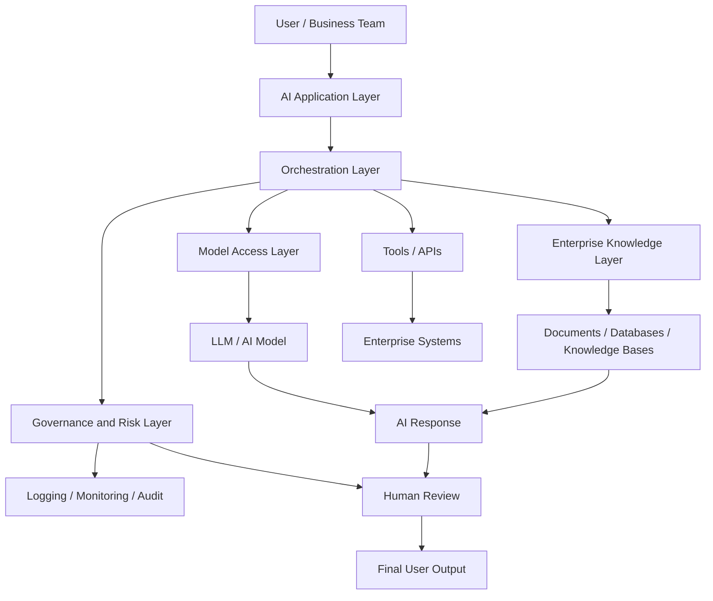
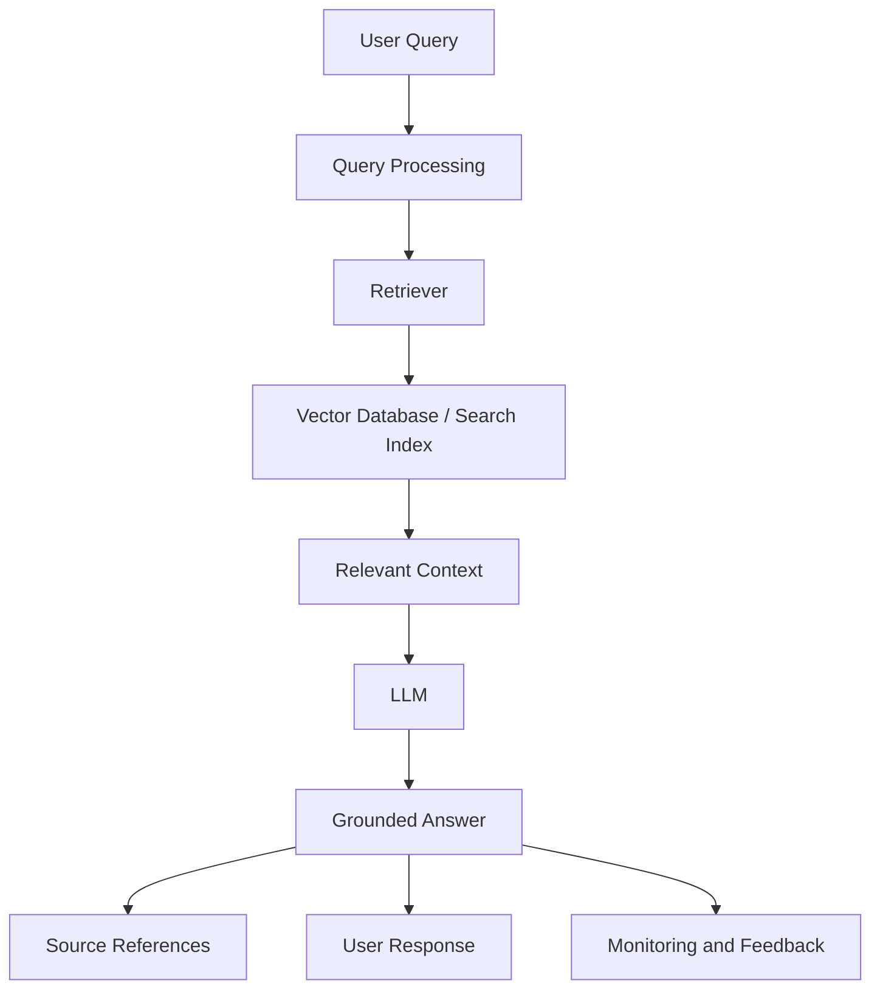
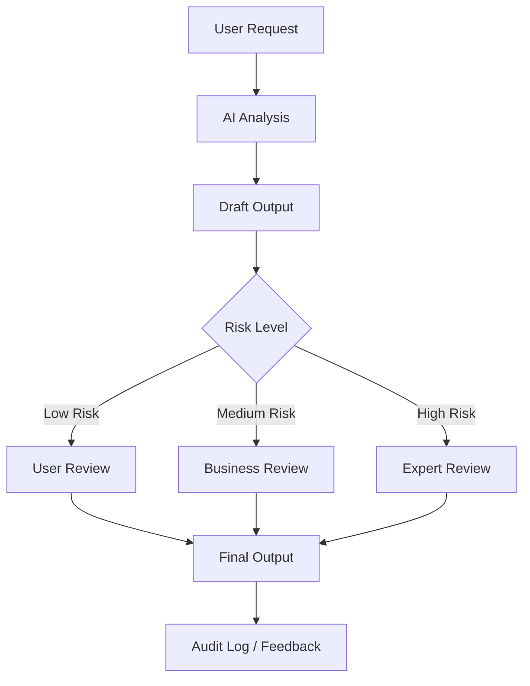

# Enterprise AI Architecture Diagrams

This document contains high-level Mermaid diagrams for enterprise AI, RAG, and human-in-the-loop workflows.

---

## 1. Enterprise GenAI Reference Architecture

---

## 2. RAG Architecture Pattern

---

## 3. Human-in-the-Loop AI Pattern

